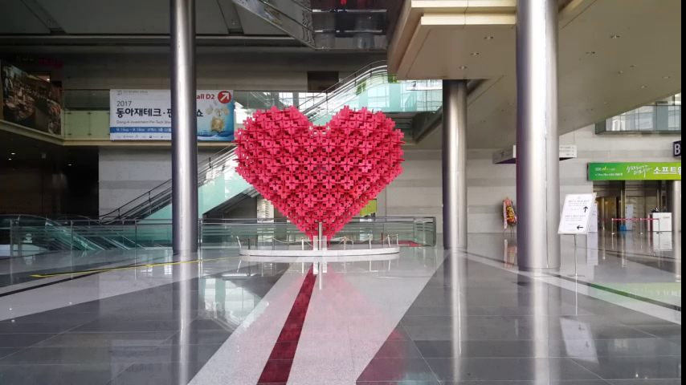

# Its-Me
1. [프로젝트 설명 및 사용방법](#프로젝트_설명_및_사용방법)
2. [데모](#데모)
3. [설치환경](#설치환경)
4. [프로젝트 환경설정](#프로젝트_환경설정)
5. [라이선스](#라이선스)
6. [사용 라이브러리](#사용_라이브러리)

## 프로젝트_설명_및_사용방법
### 프로젝트 설명
5초정도의 영상 촬영을 통해 배경에 나오는 자잘한 움직이는 물체들을 없애주고 원하는 인물만 나오는 사진을 얻을 수 있는 프로그램이다.
프로그램은 촬영한 영상에서 배경의 유사도를 측정하여 사람이 없는 배경을 만들어 낸다.
또 프레임 별로 인식된 얼굴에서 감정을 분석하여 최적의 얼굴을 판단한 뒤 저장한다. 결과물 출력부분에서 사용자가 저장되어있는 사람의 모습을 선택적으로 사진에 삽입할 수 있도록 되어있다.

### 사용방법
1. 프로젝트 실행 후 Release모드로 변경.
2. 프로젝트 실행 후 영상파일을 선택함. (영상파일의 경로에 한글이 있으면 안된다.)
3. making dialog가 띄워지며 배경을 구하기 및 감정 분석 연산을 실시함.
4. 구해진 배경이 띄워지며 우측에는 첫 프레임에서 잡아낸 사람이 나옴.
 * 정의된 RECURSIVE_COUNT 값만큼 감정분석에 들어갈 사람이미지의 수를 정한다.
 * SAVE_TEST_FILES 전처리기 설정 시 감정분석에 들어가는 사람이미지를 .jpg 형태로 저장하여 중간 산출물을 볼 수 있다.
 * DETECT_EMOTION 설정 시 배경 연산 후 감정분석을 하고 해제 시 감정분석 없이 배경 연산 후 3번과정이 띄워진다.
## 데모
>배경을 구하는 기능

Input Video

Output Image
## 설치환경
본 모듈은 GUI 형태의 모듈로서 Window 환경에서 사용가능합니다.

1. Qt 5.6 이상
2. Opencv 3.1.0 이상
3. C++ 14 버전 이상
4. Visual Studio 2015 버전
5. CUDA 8.0 버전
위 3가지 프로그램이 없을 경우는 아래의 가이드를 따라 설치해주시길 바랍니다.

### Qt 설치
 * [Qt 설치법](https://www.qt.io/qt5-6/)
 	- 3.5 이상 버전을 권장합니다.
 	- 위 링크대로 설치해주시면 됩니다.
	- 설치위치를 C드라이브 최상위 폴더에 하시기 바랍니다.(그 외의 위치 설치시 프로젝트 구성 수정필요)
### Opencv 설치
 * [Opencv 설치법](http://www.opencv.org/releases.html)
	- 링크에서 3.1.0 이상 버전 설치 권장
	- 설치위치를 C드라이브 최상위 폴더에 하시기 바랍니다.(그 외의 위치 설치시 프로젝트 구성 수정필요)
### Visual Studio 2015 설치
 * [Visual Studio 2015 설치법](https://www.visualstudio.com/ko/vs/older-downloads/)
	- 링크에서 2015버전 설치
### CUDA 설치
 * [CUDA 설치법](https://developer.nvidia.com/cuda-downloads)
	- CUDA 버전 8.0 권장
	- 링크에서 설치
### data 파일 설치 방법
 *[Data 폴더에 들어갈 파일](https://drive.google.com/file/d/0Bz4K5ZksOqu7aFh3S0tRVVpTcFE/view?usp=sharing)
 * 프로젝트 내의 Its-Me\build\darknet\data 에 링크에서 받은 압축파일을 푼다.

## 프로젝트_환경설정
 * 위 버전이외의 버전 사용시 프로젝트 구성 수정이 필요합니다.
 
## 라이선스
* [GPL Liscense (GPLv3)](LICENSE)

GPLv3 라이센스 하에 공개하는 오픈소스 소프트웨어입니다.
## 사용_라이브러리

### [OPENCV](http://opencv.org) 
>OPENCV
>ver 3.1.0
>licensed under 3-clause BSD License(BSD)

* **용도 :**  영상처리
* **라이선스 :** Berkeley Software Distribution(BSD)
* **라이선스 전문 :** [OpenCV](http://opencv.org/license.html)

### [Darknet](https://pjreddie.com/darknet/)
>Darknet is an open source neural network framework written in C and CUDA.
>It is fast, easy to install, and supports CPU and GPU computation.

* **용도 :**  사람추적 후 마스킹
* **라이선스 :** YOLO LICENSE
* **라이선스 전문 :** [YOLO](https://github.com/AlexeyAB/darknet/blob/master/LICENSE)

### [Dlib](http://dlib.net)
>Dlib is a modern C++ toolkit containing machine learning algorithms and tools for creating complex software in C++ to solve real world problems.

* **용도 :**  얼굴인식
* **라이선스 :** Boost Software License(BSL)
* **라이선스 전문 :** [Dlib](http://dlib.net/license.html)

### [Emotion-Detection](https://github.com/3q12/Emotion-Detection)
>Emotion Recognition is the process of identifying human emotion, mostly from facial features.

* **용도 :**   감정학습 및 분석
* **라이선스 :** GNU General Public License v3.0(GPLv3.0)
* **라이선스 전문 :** [Emotion-Detection](https://github.com/athulsnambiar/Emotion-Detection/blob/master/LICENSE)
* **소스코드 :** [https://github.com/athulsnambiar/Emotion-Detection/](https://github.com/athulsnambiar/Emotion-Detection)

### [QT](https://www.qt.io/)
>Qt is much more than just a cross-platform SDK - it's a technology strategy that lets you quickly and cost-effectively design, develop, deploy, and maintain software while delivering a seamless user experience across all devices.

* **용도 :**  GUI
* **라이선스 :** GPL and LGPLv3/commercial
* **라이선스 전문 :** [Qt](https://www1.qt.io/licensing/)
